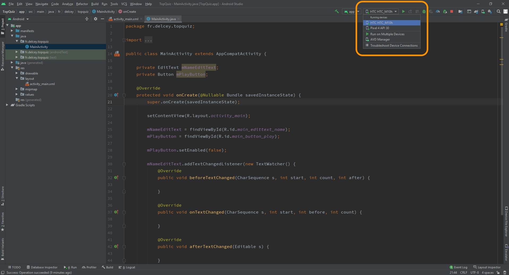
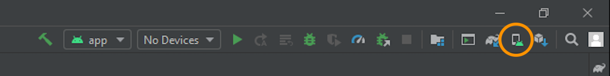
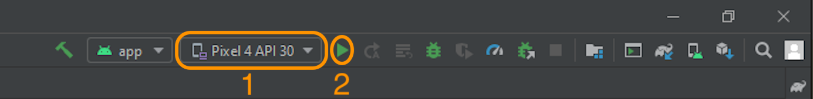

# THURII 

**Thurii** is an outdoor sports application developped by the **BoubouleCorp**.  
This repository is for the mobile app based on [Kotlin](https://developer.android.com/kotlin)

## Introduction

To use this project, you first need to clone this repositository.

## Android Studio IDE setup

For development, the latest version of **Android Studio** is required. The latest version can be downloaded from [here](https://developer.android.com/studio/).   
Then open this project in Android Studio.

## Getting started

### With your android phone (recommended)

To launch your application on your phone there are some settings to do so that the device is recognized and functional : 
  - Activate the **developer mode** ([i need help](https://developer.android.com/studio/debug/dev-options.html#enable))
  - Enable **usb debugging** ([i need help](https://developer.android.com/studio/run/device.html#setting-up))

Then select your device and lunch the application on your smartphone.   

### With an emulator

First, create your emulator by clicking on the **divice manager** button.   

Then select and launch the application on your emulator.   

 
### Additional documentation

For more resources on learning Android development, visit the [Developer Guides](https://developer.android.com/guide) at [developer.android.com](https://developer.android.com/).

## Lunch Tests

.......................................................

## Libraries Used

.......................................................

## Licences

Copyright 2022 BouvouleCorp, Inc.     
More details [here](https://youtu.be/dQw4w9WgXcQ)

## Support

Please contact us on this email address for anything to report     
**bouboulecorp@gmail.com**
