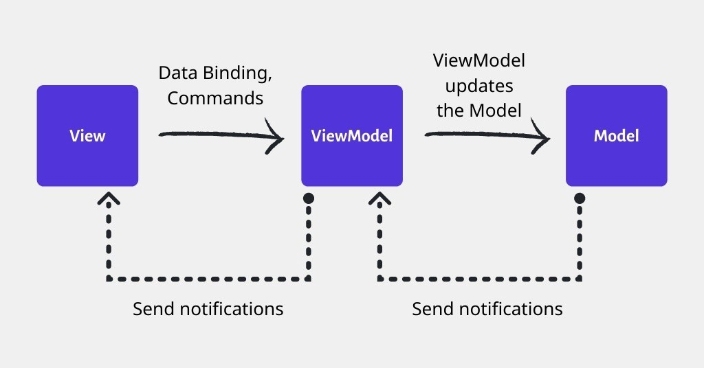

# Architecture of Thurii Mobile App

The project is based on the MVVM (Model View ViewModel) Architecture Pattern

### Model:
The model represents the set of entities and data models that the view will need to present information to the user.

### View :

The view represents the visible part of the iceberg, i.e. the graphical interfaces (activities, fragments), XML, widgets, animations, texts and all the components that interact directly with the end user. It constitutes the visual part of the application, it is the showcase that presents the information provided by the Model and processed by the ViewModel

### View Model :

The ViewModel represents the layer that manages all the business logic of the application, it concerns the processing operations that take place between the database and the view, for example the formatting of data, the sending of parameters to the queries, the reception of data.

## Adventage

### Maintainability: 
With a clear separation of the different modules of the project, there is a better structural organisation, the code is more readable, better structured because it respects well-defined standards and therefore easier to maintain. As the functionalities are grouped together in the ViewModel, this allows for clean views, free of 'spaghetti' code.

### Testability: 
With MVVM each piece of code is written in a granular way, internal and external dependencies are separated from the business logic and the set of features to be tested. This makes the code much more testable.

### Code reusability and extensibility: 
MVVM facilitates the possibility of adding and reusing code by the principle of weak class coupling, which has the benefit of reducing the risks of heavy technical debt during evolutionary maintenance.!

## MVVM recommended by Google for Android applications

According to [android developers](https://developer.android.com/topic/architecture)

## Implementation

### Getting started : comming soon...

### Example :

[Here](https://github.com/larroyo3/Example_Thurii_App)

## Additional documentation

comming soon...
